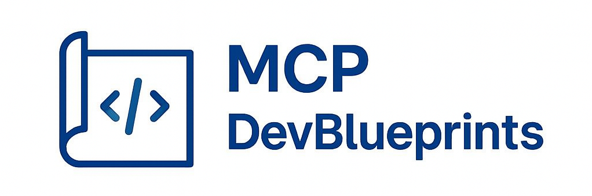
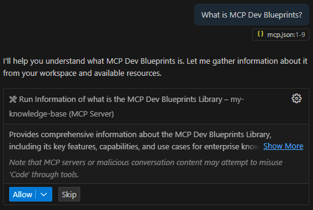

# MCP Dev Blueprints



**Transform your organization's knowledge into intelligent AI tools with minimum development.**

## What is MCP Dev Blueprints?

MCP Dev Blueprints is a powerful, configuration-driven framework that enables organizations to create and deploy Model Context Protocol (MCP) servers using simple JSON files. Turn your company's coding standards, best practices, and documentation into AI-accessible tools that enhance developer productivity.

## ✨ Key Benefits

- 🛠️ **Easy Configuration** - Create sophisticated AI tools using only JSON configuration files
- 🚀 **Flexible Deployment** - Run as standalone HTTP servers or integrate as npm packages
- 🏢 **Enterprise Ready** - Centralize organizational knowledge and coding standards
- ⚡ **Instant Results** - Deploy in minutes, not hours
- 🔧 **Extensible** - Add custom TypeScript tools for advanced functionality
- 📊 **Multi-Client Support** - Works with VS Code, Claude, JetBrains, and more


## What Can You Build?

### 🏢 Enterprise Knowledge Management
- Coding standards and style guides
- Architecture patterns and decisions
- API documentation and examples
- Deployment procedures and checklists

### 🔧 Development Tools
- Code generation templates
- Testing guidelines and patterns
- Security best practices
- Performance optimization guides

### 📚 Team Resources
- Onboarding documentation
- Troubleshooting guides
- Reference materials
- Process documentation

## Quick Start Guide

### Prerequisites

- **Node.js** 20 or higher
- **npm** (included with Node.js)

### Option 1: Try It Instantly (Recommended)

Get started in under 2 minutes using npx:

```bash
# Create your knowledge base directory
mkdir my-knowledge-base && cd my-knowledge-base

# Create a basic server configuration
cat > servers.json << 'EOF'
[
    {
        "name": "my-company-kb",
        "path": "my-company-kb", 
        "features": ["company-standards.json"]
    }
]
EOF

# Create your first feature file
cat > company-standards.json << 'EOF'
{
    "tools": [
        {
            "id": "coding_standards",
            "title": "Company Coding Standards",
            "description": "Our organization's coding standards and best practices.",
            "content": [
                {
                    "type": "text",
                    "text": "## Coding Standards\n\n- Use TypeScript for all new projects\n- Follow ESLint configuration\n- Write unit tests with >80% coverage\n- Use conventional commit messages"
                }
            ]
        }
    ],
    "resources": [],
    "prompts": [],
    "custom_tools": [],
    "custom_resources": [],
    "custom_prompts": []
}
EOF

# Start the server
npx mcp-dev-blueprints --kb-path . --mode http
```

Your MCP server is now running at `http://localhost:3000`! 🎉

### Option 2: Install and Develop Locally

```bash
# Clone and setup
git clone https://github.com/psbds/mcp-dev-blueprints.git
cd mcp-dev-blueprints
npm install

# Start in development mode
npm run dev
```

### Integration with AI Clients

#### VS Code + GitHub Copilot

With the MCP Server Running locally, you can use it with VSCode by following those steps:

1. **Install GitHub Copilot Chat** extension in VS Code

2. **Configure MCP** - Press `F1` → `MCP: Open User Configuration`

3. **Add your server**:
   ```json
   {
       "servers": {
           "my-company-kb": {
               "type": "http",
               "url": "http://localhost:3000/my-company-kb"
           }
       }
   }
   ```

4. **Start the server** - Press `F1` → `MCP: List Servers` → Select your server → `Start Server`

5. **Test it** - Open Copilot Chat in `Agent Mode` and ask: *"What is MCP Dev Blueprints?"*, the following widget should appear on the screen.

    

6. By pressing allow, the MCP Server will be called and the contents will be added to the context of the Chat,so the LLM Model can use it.
### Other AI Clients

You can use the MCP Servers in other MCP Clients, such as: 
- **[Claude Desktop](https://docs.claude.com/en/docs/claude-code/mcp)** - Professional AI assistant
- **[Visual Studio](https://learn.microsoft.com/en-us/visualstudio/ide/mcp-servers?view=vs-2022)** - Microsoft's IDE
- **[JetBrains IDEs](https://www.jetbrains.com/help/idea/mcp-server.html)** - IntelliJ IDEA, PyCharm, etc.

## Documentation

| Document | Description |
|----------|-------------|
| **[Configuration Guide](docs/CONFIGURATION.md)** | Complete configuration reference |
| **[Running Guide](docs/RUNNING.md)** | Deployment and execution options |
| **[Tools Reference](docs/TOOLS.md)** | Creating and configuring tools |
| **[Customization Guide](docs/CUSTOMIZING.md)** | Advanced TypeScript extensions |

## Contributing

We welcome contributions! Please see our [contributing guidelines](CONTRIBUTING.md) and [commit conventions](docs/COMMIT_CONVENTION.md).

## Support

- 📖 **Documentation**: Comprehensive guides in the `/docs` folder
- 🐛 **Issues**: [GitHub Issues](https://github.com/psbds/mcp-dev-blueprints/issues)
- 💬 **Discussions**: [GitHub Discussions](https://github.com/psbds/mcp-dev-blueprints/discussions)

## License

MIT License - see [LICENSE](docs/LICENSE) for details.

---

**Ready to transform your organization's knowledge into AI-powered tools?** [Get started now](#quick-start-guide) or explore our [comprehensive documentation](docs/).